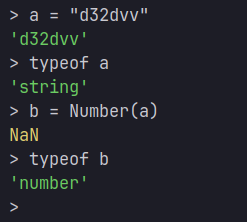

# Datatype Conversions

## Implicit Conversion
- Happens automatically in operations with mixed types
- Examples: `5 + "5"` → `"55"`, `"5" - 1` → `4`
---
## Explicit Conversion
- String conversion: `String(value)` or `value.toString()`
- Number conversion: `Number(value)`, `parseInt(value)`, `parseFloat(value)`
- Boolean conversion: `Boolean(value)`
---
```javascript
// String to Number
const str = "42";
const num1 = Number(str);      // 42
const num2 = parseInt(str);    // 42
const num3 = +str;             // 42 (unary plus operator)

// Number to String
const num = 42;
const str1 = String(num);      // "42"
const str2 = num.toString();   // "42"
const str3 = num + "";         // "42" (concatenation)

// To Boolean
const bool1 = Boolean(1);      // true
const bool2 = !!0;             // false (double NOT operator)
```
---

# NaN
`NaN` stands for "Not a Number" in JavaScript. It represents an invalid or unrepresentable mathematical operation.
Key points about NaN:

- Created when a mathematical operation fails (like `0/0` or `parseInt("hello")`)
- Has the type `number` despite its name
- Is the only JavaScript value that is not equal to itself `(NaN !== NaN)`
- Can be checked using `isNaN()` or the more reliable `Number.isNaN()`
- Any operation with `NaN` results in `NaN`

Example:
```javascript
console.log(typeof NaN);           // "number"
console.log(NaN === NaN);          // false
console.log(Number.isNaN(NaN));    // true
console.log(Number.isNaN("text")); // false
console.log(isNaN("text"));        // true (converts to NaN first)
```

> *My Doubt*: \
 \
`b` is "NaN" (not a number), and yet `typeof b` displays it to be a number. WHY?

Here's why. \
In javascript's type system, the `NaN` value is technically assigned as a number. In simple words it is a type of number that holds an invalid or unrepresentable mathematical unit. `NaN` is basically a number that is invalid to be defined in the mathematical form of a number. 
